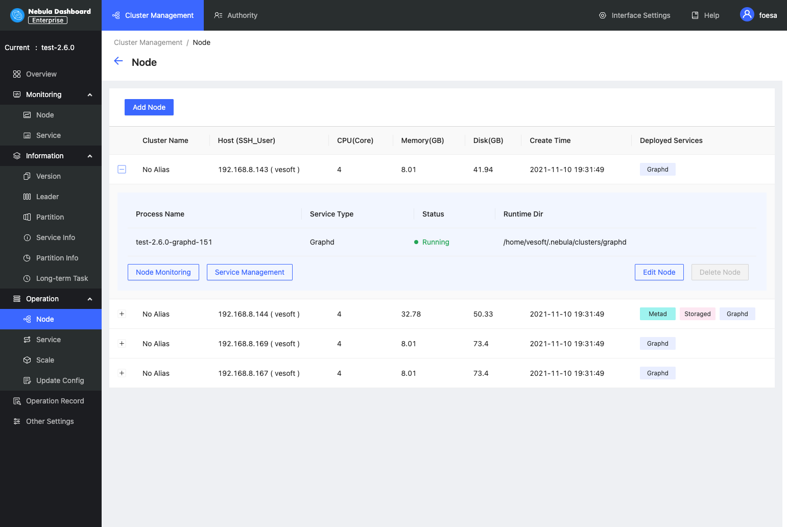
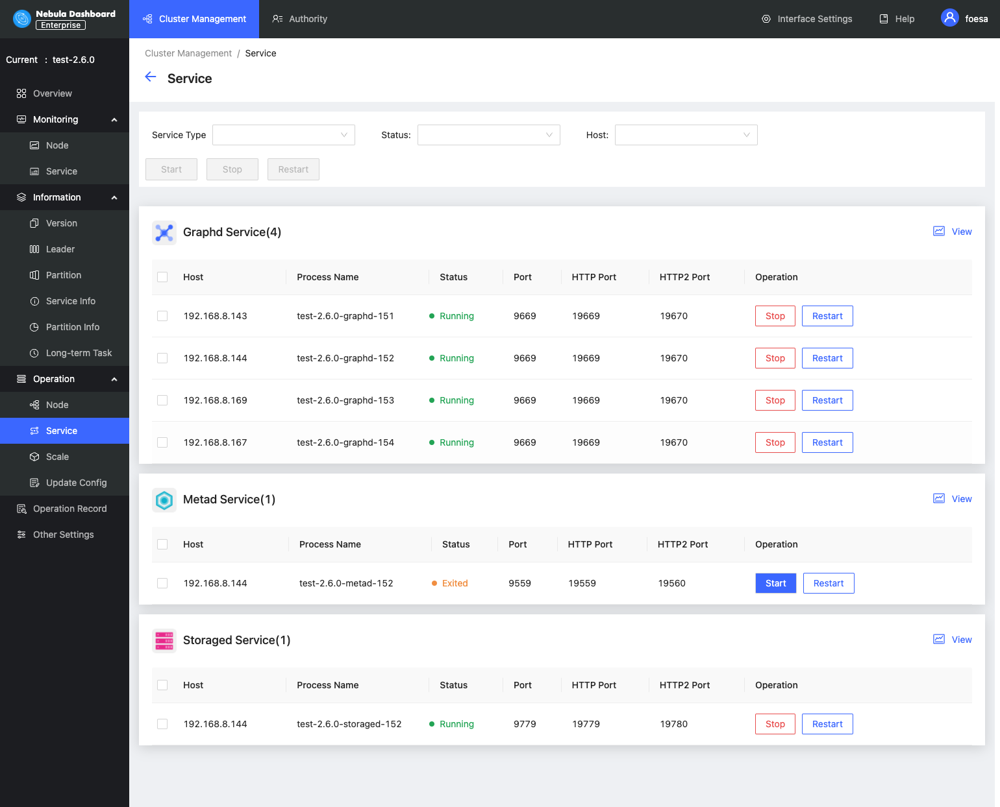
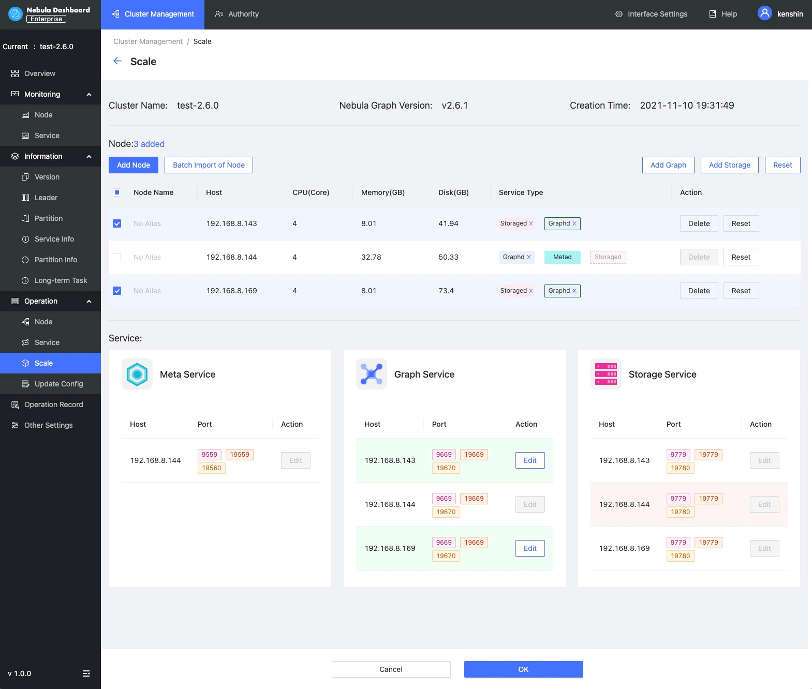
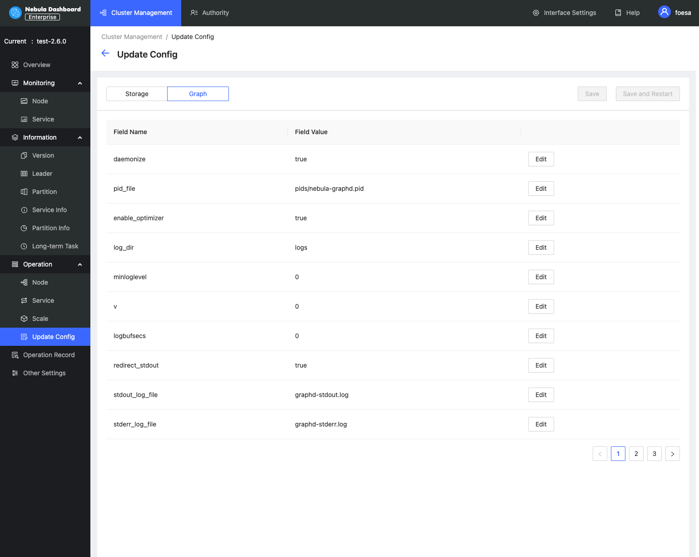

# Cluster operation

This topic introduces the cluster operation of Dashboard. The cluster operation has the following four parts:

- Node
- Service
- Scale
- Update config

## Node

On this page, the information of all nodes will be shown, including the cluster name, Host(SSH_User), CPU (Core), etc.

- To add a node quickly, click **Add node** and enter the following information, the Host, SSH port, SSH user, SSH password, and select a Nebula Graph package.

- Click the  button to view the process name, service type, status, runtime directory of the corresponding node.

  - Click **Node monitoring** to jump to the detailed node monitoring page. For more information, see [Cluster monitoring](../4.cluster-operator/2.monitor.md).

  - Click **Edit node** to modify the SSH port, SSH user, and SSH password.
  
  - If a node has no service, you can **delete the node**.

## Service

- On this page, you can select the service type, service status, and Host to filter the shown data, quickly select one or multiple services, and start/stop/restart the service with one click.

- Click the  icon to quickly view the [Service monitoring](../4.cluster-operator/2.monitor.md).

!!! danger

    If you click **Stop**/**Restart**, the running task will be stopped instantly, which may cause data inconsistency. It is recommended to perform this operation during the low peak period of the business.

## Scale

- On this page, you can **add node** and **import node in batches** quickly, and add **Graph services** and **Storage services** to the existing nodes.
- Click the **Reset** button to restore to the initial state.

!!! caution

    Currently, you can dynamically scale Storaged and Graphd services through Dashboard. The Metad service cannot be scaled. When scaling a cluster, it is recommended to back up data in advance so that data can be rolled back when scaling fails. For more information, see [FAQ](../../20.appendix/0.FAQ.md#_11).

In this example, storage services with nodes `192.168.8.143` and `192.168.8.167` are added, and Graph services with node `192.168.8.169` are deleted. If the box is dotted and the service name is greyed, it means the service is removed. If the box is solid, it means the service is newly added.

In the **services** below, green indicates services that will be added soon, and red indicates services that will be removed. You can modify the port, HTTP port, and HTTP2 port of the newly added service.

## Update config

On this page, you can modify configuration files of Storage and Graph services. For more information, see [Storage service configuration](../../5.configurations-and-logs/1.configurations/4.storage-config.md) and [Graph service configuration](../../5.configurations-and-logs/1.configurations/3.graph-config.md). Updating configuration files is a batch operation, and each Storage/Graph configuration file will be modified.

- After clicking **Save**, the configuration will take effect after the next service restart.

- Click **Save and restart** to directly restart the service to make the configuration take effect immediately.

  !!! danger

        If you click **Save and Restart**, the running task will be stopped and the cluster will be restarted instantly, which may cause data inconsistency. It is recommended to perform this operation during the low peak period of the business.

