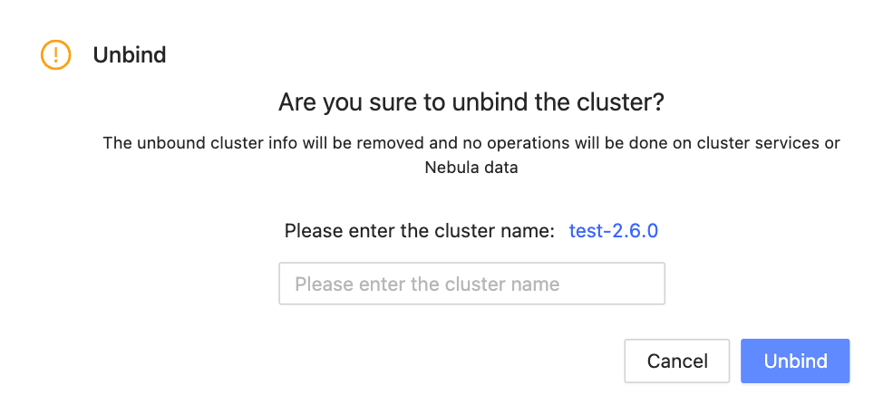
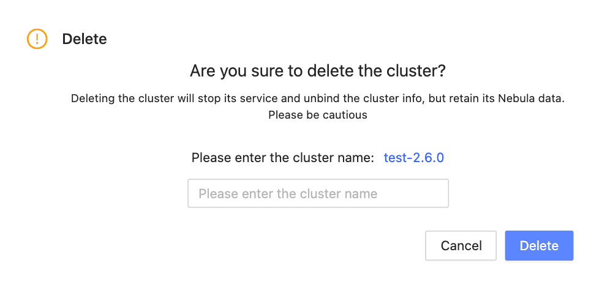

# Other settings

The following shows other settings in Nebula Dashboard.

- Information: shows the cluster name, the creation time, and the creator.

- Unbind: Unbind a cluster and remove its information from the platform. The unbound cluster info will be removed and no operations will be done on cluster services or Nebula data.

  !!! note

        To unbind a cluster, enter the cluster name first.

  

- Delete: Delete a cluster and remove its information from the platform. Deleting the cluster will stop its service and unbind the cluster info, but retain its Nebula data. Be cautious when you delete a cluster.

  !!! note

        To delete a cluster, enter the cluster name first

  
