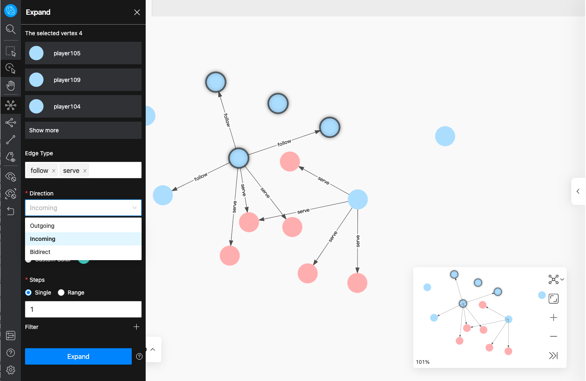
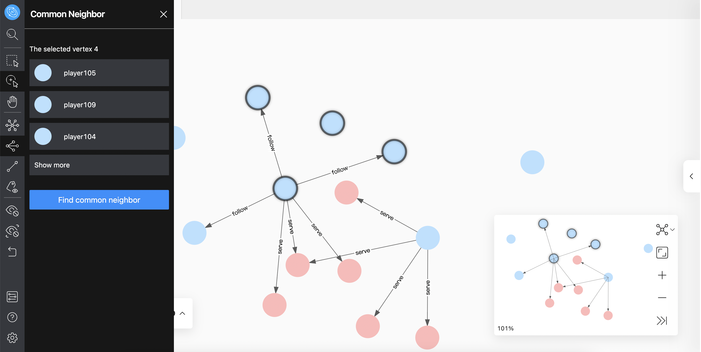
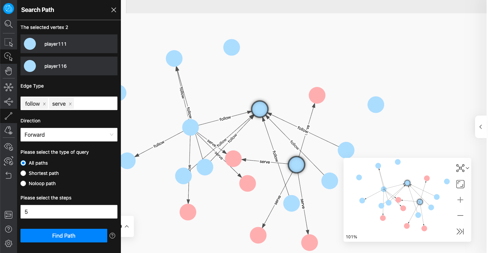
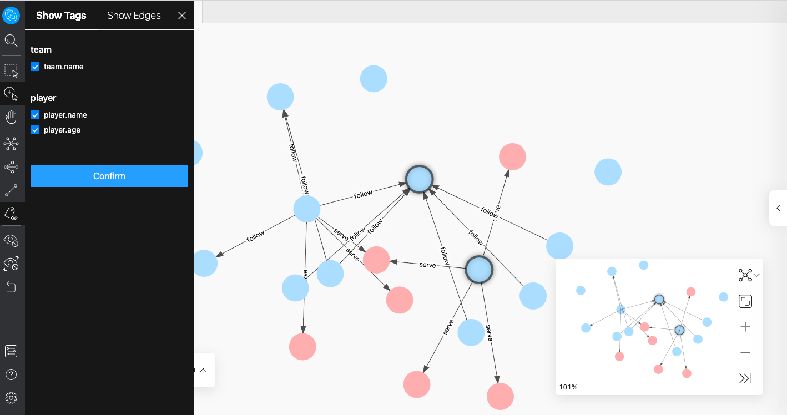

# Graph exploration and expansion

Graph exploration and expansion is divided into the following four parts:

- Expand
- Common neighbor
- Search path
- Inspect property

## Expand

In the sidebar, click the  icon to open the **Expand** window. You can double-click a vertex to expand directly. You can also select multiple vertexes in the canvas, modify the edge type in the operation bar, select the inflow and outflow of the edge, modify the color of the vertex, specify the number of expansion steps and custom filter conditions.

!!! Note
    
    After the configuration in the panel is modified, the current configuration will be saved, and the current configuration will be expanded when double-clicking or right-clicking to quickly expand.

## Common neighbor

In the sidebar, click the  icon to open the **Common Neighbor** window. You can select two or more vertexes on the canvas and query their common neighbors. When the selected vertexes have no common neighbor, the default returns **There is no data**.

## Search path

In the sidebar, click the [findpath](../figs/rightclickmenu-findPath.png) icon to open the **Search path** window. You can select two vertexes in the canvas. By default, the first vertex selected is the starting point, and the second vertex is the ending point. You can customize the type and direction of the edge, specify the number of expansion steps, and choose to query the following three paths: `All path`, `Shortest path` and `Noloop path`.

## Inspect property

In the sidebar, click the  icon to open the **Inspect property** window. You can choose to show or hide the property of vertexes or edges in the canvas. After clicking confirm, the property will be displayed on the canvas only when the zoom ratio is greater than 100%, and automatically hidden when the zoom ratio is less than 100%.

