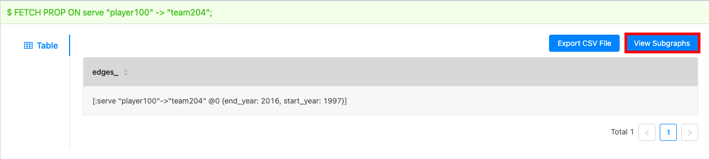
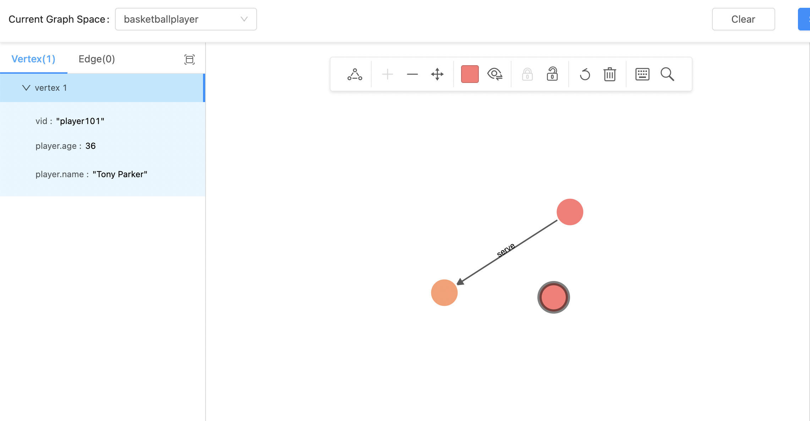

# Query graph data

When data is imported, you can use the **Console** page or the **Explore** page to query graph data.

!!! Note

    Users can also perform the following query operations online through [Studio](https://playground.nebula-graph.io/explore).

For example, if you want to query the edge properties of the player named `player100` to the team named `team204`, you can perform these optional operations:

* On the **Console** tab: Run `FETCH PROP ON serve "player100" -> "team204";`. The result window shows all the property information of this vertex. When the result returns, click the **View Subgraph** button and then you can view the vertex information in a visualized way.  

* On the **Explore** tab: Click the **Start with Vertices** button. In the dialog box, enter **player101** and then click the **Add** button. On the board, you can see the vertex. Move your mouse pointer on the vertex to see the vertex details, as shown in the preceding figure.

