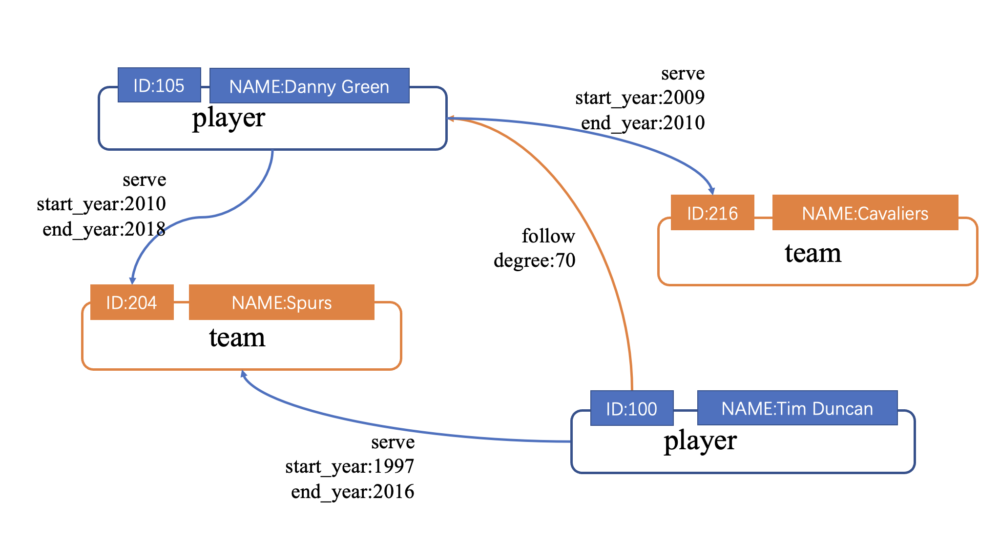

# Design a schema

To manipulate graph data in Nebula Graph with Studio, you must have a graph schema. This article introduces how to design a graph schema for Nebula Graph.

A graph schema for Nebula Graph must have these essential elements:

- Tags (namely vertex types) and their properties.

- Edge types and their properties.

In this article, you can install the sample data set [basketballplayer](https://docs-cdn.nebula-graph.com.cn/dataset/dataset.zip) and use it to explore a pre-designed schema.

This table gives all the essential elements of the schema.

| Element  | Name  | Property name (Data type)  |  Description  |
| :---  | :---  | :---  | :---  |
| Tag |  **player**  | - `name` (`string`)  - `age` (`int`)  | Represents the player.  |
| Tag |   **team** | - `name` (`string`) |  Represents the team. |
| Edge type |  **serve**  | - `start_year` (`int`)   - `end_year` (`int`) | Represent the players behavior. This behavior connects the player to the team, and the direction is from player to team. |
| Edge type |  **follow**  | - `degree` (`int`)  | Represent the players behavior. This behavior connects the player to the player, and the direction is from a player to a player. |

This figure shows the relationship (**serve**/**follow**) between a **player** and a **team**.

